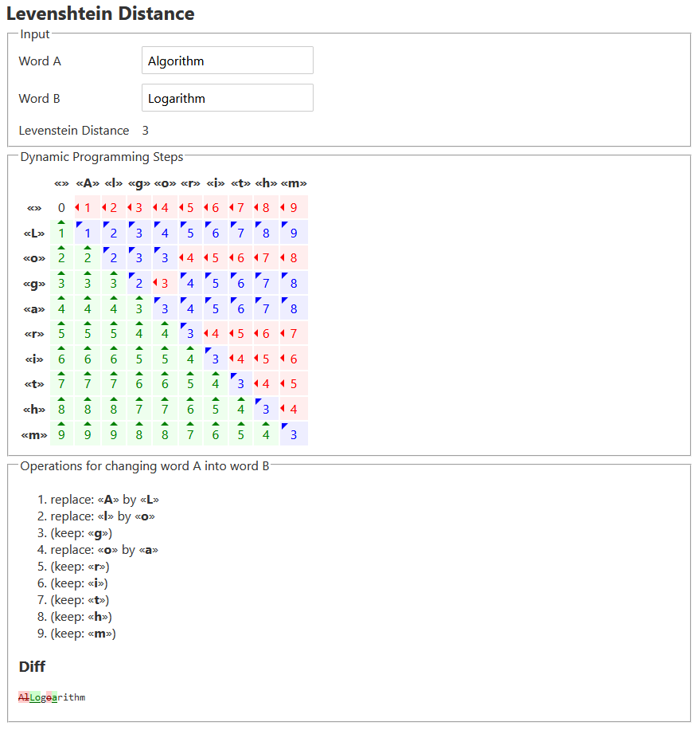

[Live Demo](https://static.laszlokorte.de/levenshtein/)

# Levenshtein Distance

The Levenshtein Distance or edit distance measures the similarity between two sequences/strings. The distance is measured in number of single character operations (delete, insert, replace) needed to transform one sequence into another.